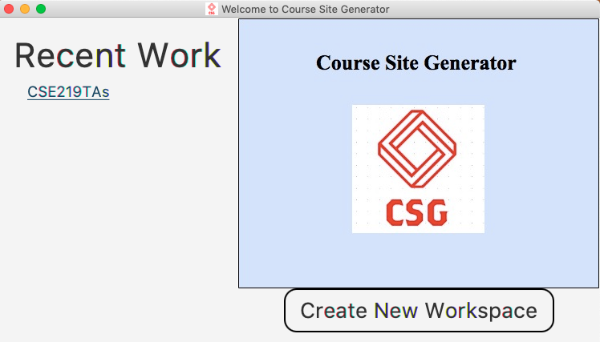
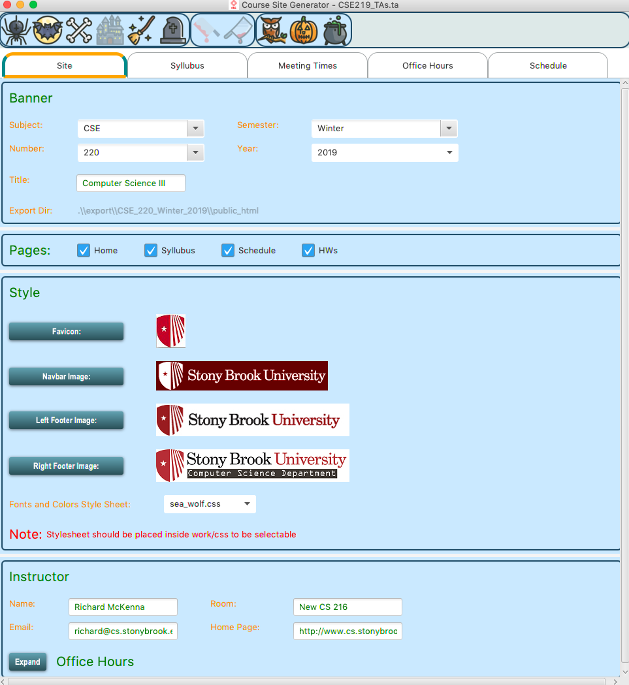
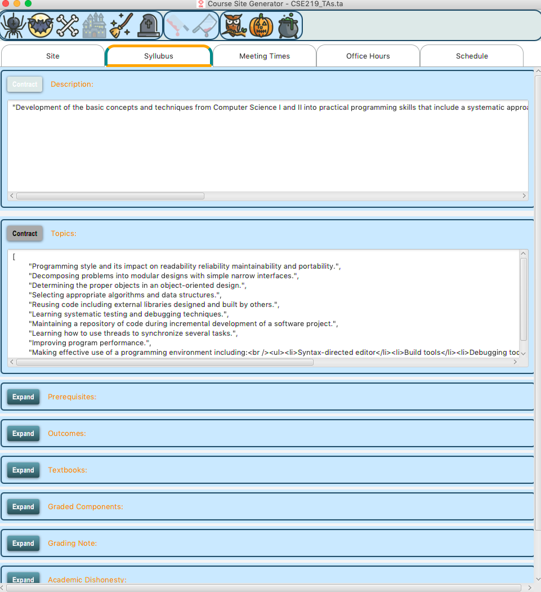
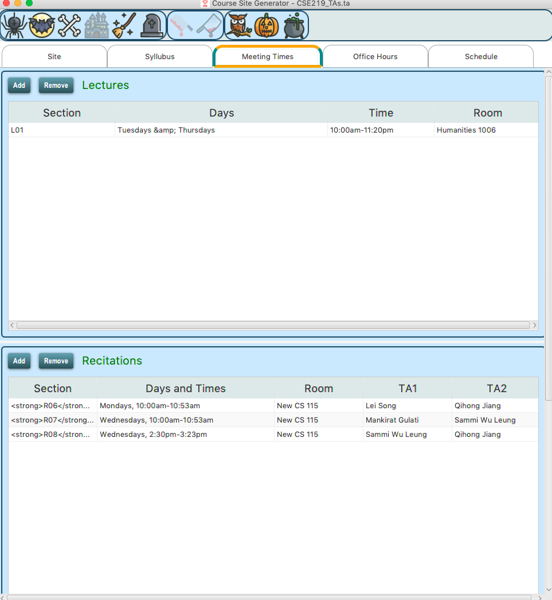
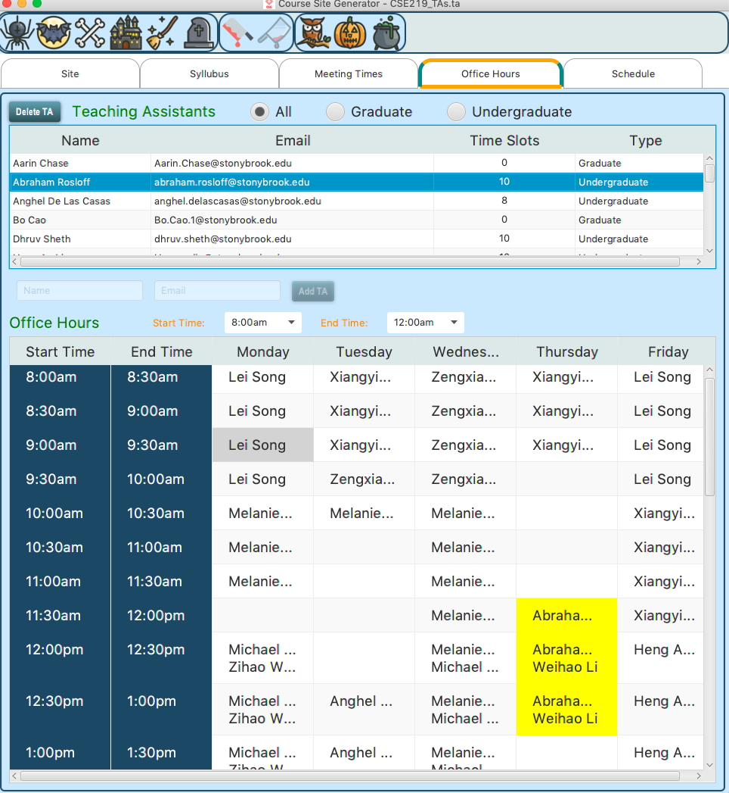
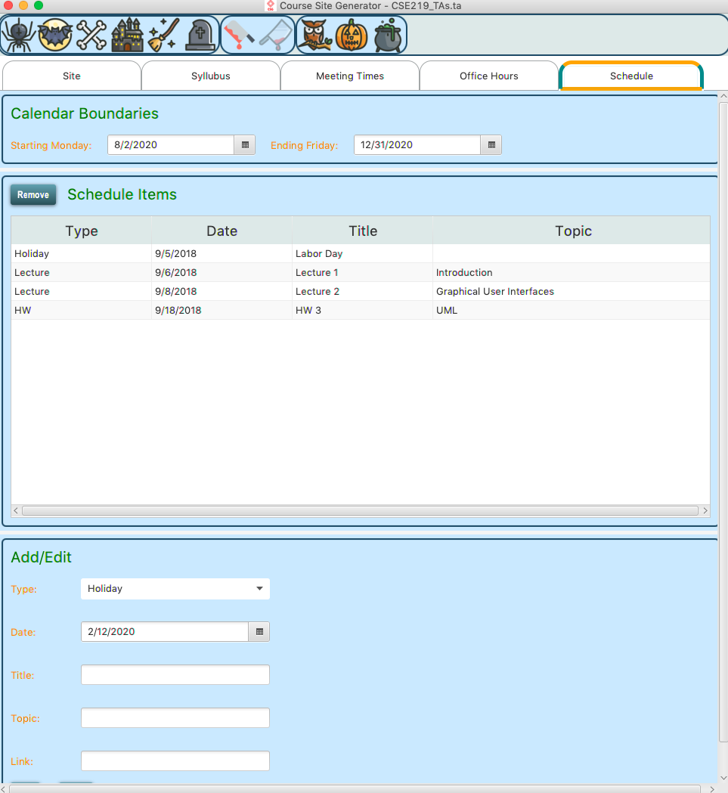
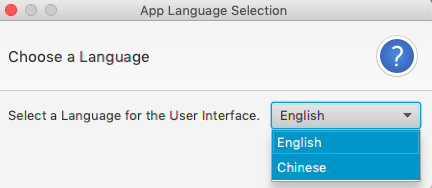
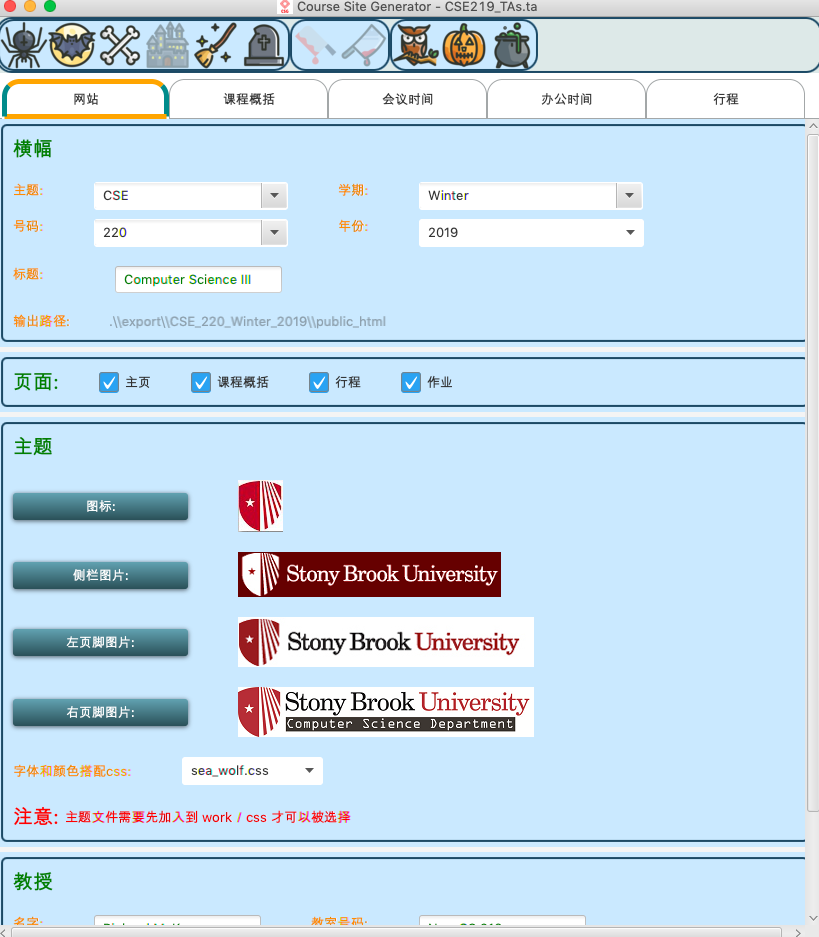
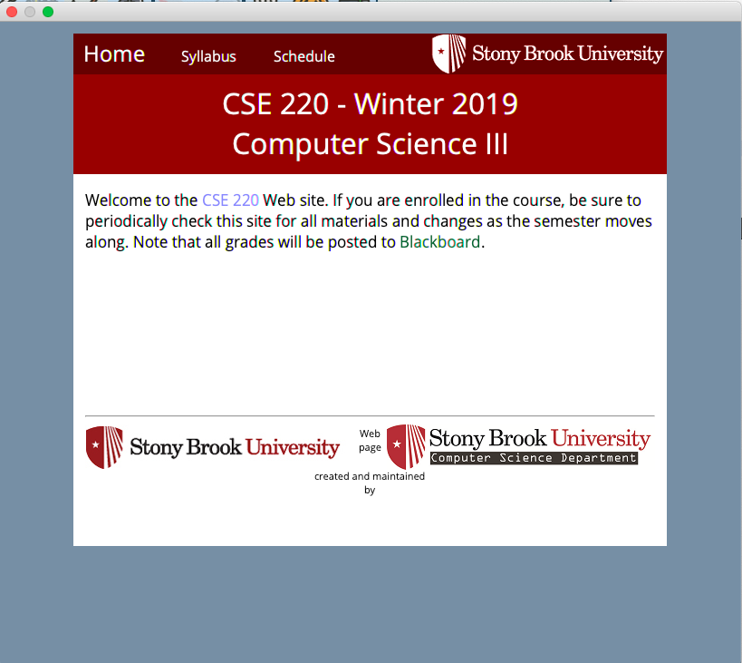

# CourseSite Generator
This is the semster long project for CSE 219 class

CourseSite Generator is a desktop Java application that gives user ability to easily
edit data and style of their website.

## Some Disclaimer:
- This project uses JSON file as database
- all users actions can be undo/redo using transaction system
- the application saves some commonly used data from user for efficiency
- The design for this project is based on personal interest, would of use more proffesional design if for other purpose

### Welcoming Dialog
- user can create a new workspace or continue on a recently used workspace

### Site Tab
- this specific project is setup for the course website
- user can edit Banner, pages, style, and instructor data

### Syllubus Tab
- this tab allows user to edit syllubus information

### Meeting Times Tab
- this tab allows user to add/remove/edit meeting times for lecture and recitation

### Office Hours Tab
- this tab is most difficault one to implement
- this tab allows user to add and delete TA and edit their office hour
- adding TA:
    - there can't be TA with same name and email
    - used regular expression to check for valid emails
    - newly added TA is sorted with last name
- filtering TA with radio button:
    - there are 3 radio button All/Graduate/Undergraduate
- adding/deleting TA office hour using toggle
    - if a TA's name is selected, then clicking on a spot in the time grid will plot his name
    - if click on a time spot with a name on it, then that name will be removed
- highlighting TA name in time grid
    - if a TA name is selected, then all office hour with that TA name have to be highlighted
- filtering time frame with start/end time
    - office hour grid can be filtered with the start and end time
    - when filtering, the TA name table will be filtered too

### Schedule Tab
- allows user to edit schedule data

### Changing Language
- user can change the language of this application

### Webview
- after all data and style is set, user can user export functionality to export all the files
- A webview window will also pop-up to show user to exported website

### Tools
- user can also save and load workspace

## Note that the style of this application is set to Halloween because when I am picking the style for it, it is the Halloween season. I will use a more professional design for other purpose.

